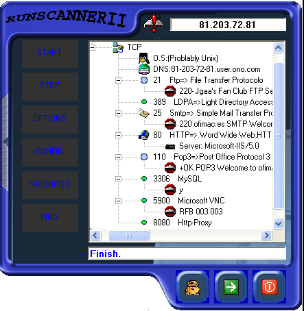



## RunScanner II

### Description

it's a scanner remote port,udp and tcp with banner,the runnerscanner is a tool very fast,i use more fast what funcionaly,see it
 
### More Info
 

             |
---                |---
**Submitted On**   |2004-03-06 12:16:06
**By**             |[Manuel\(ErcUn\)](https://github.com/Planet-Source-Code/PSCIndex/blob/master/ByAuthor/manuel-ercun.md)
**Level**          |Beginner
**User Rating**    |5.0 (10 globes from 2 users)
**Compatibility**  |VB 6\.0
**Category**       |[Internet/ HTML](https://github.com/Planet-Source-Code/PSCIndex/blob/master/ByCategory/internet-html__1-34.md)
**World**          |[Visual Basic](https://github.com/Planet-Source-Code/PSCIndex/blob/master/ByWorld/visual-basic.md)
**Archive File**   |[RunScanner171699362004\.zip](https://github.com/Planet-Source-Code/manuel-ercun-runscanner-ii__1-52190/archive/master.zip)

